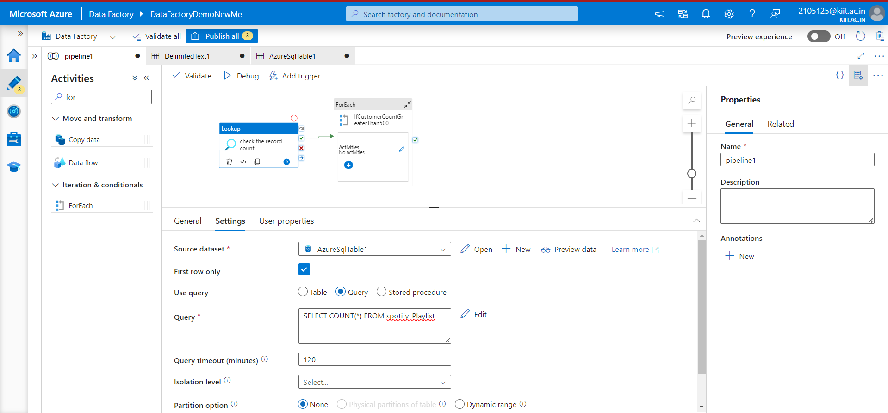
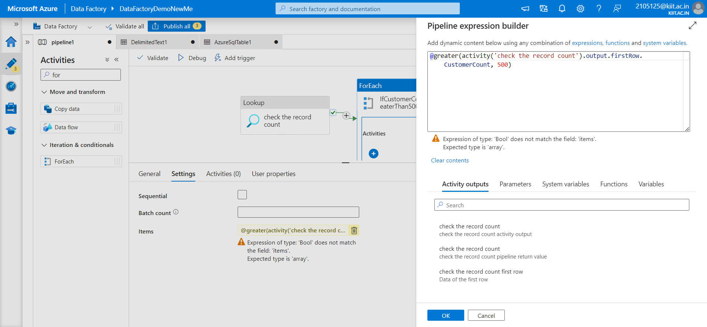
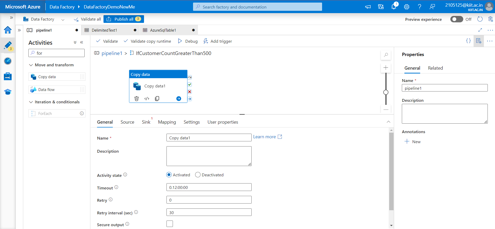
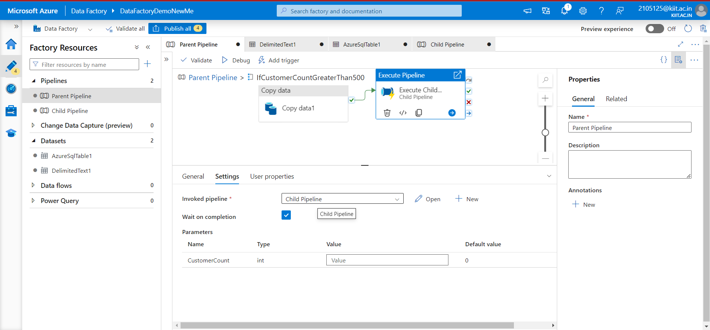
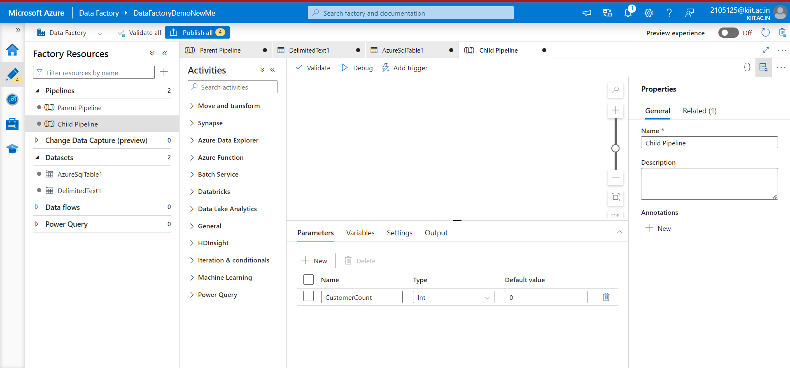
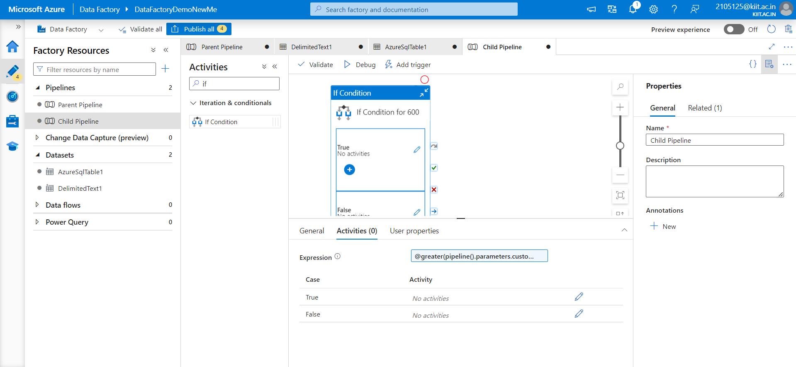
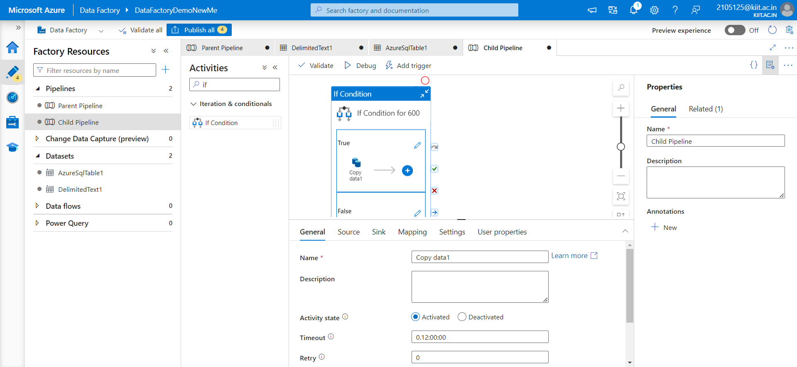
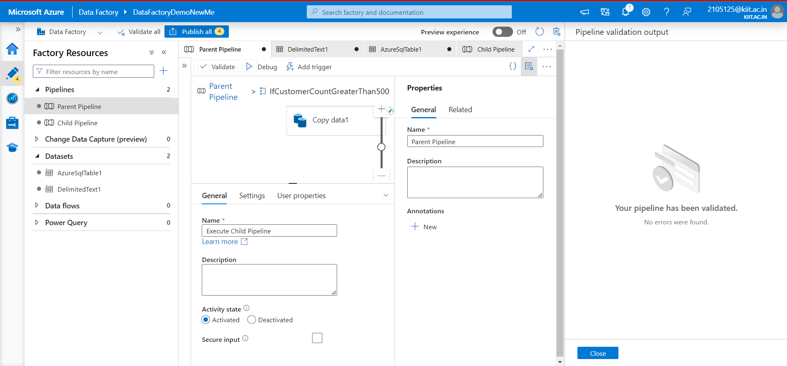

# Q3 and Q4

#### Q3 ) **Create a pipeline to copy customer data from db to adls only if record count is more than 500. Once a data get copy it should call a child pipeline (which will copy the product data from table if customer record count is > 600).**

**Create the Parent Pipeline (Customer Data Pipeline):**

* **Step 1: Create a new pipeline.**
* **Step 2: Add a Lookup activity** to check the record count of the customer data table. Configure it to execute a query that returns the record count.
* 
* **Step 3: Add an If Condition activity** to evaluate if the record count is greater than 500
* 
* **Step 4: Inside the If Condition activity (True branch), add a Copy Data activity** to copy customer data from the database to ADLS.
* 
* **Step 5: Add an Execute Pipeline activity** inside the True branch of the If Condition activity to call the child pipeline (Product Data Pipeline).
* 
* **Create the Child Pipeline (Product Data Pipeline):**
* ****Add a parameter to the child pipeline** to accept the customer count value.**
* 
* **Add an If Condition activity** to evaluate if the customer count is greater than 600.
* 
* **Inside the If Condition activity (True branch), add a Copy Data activity** to copy product data from the database to ADLS.
* 

### Validate the Pipeline 

