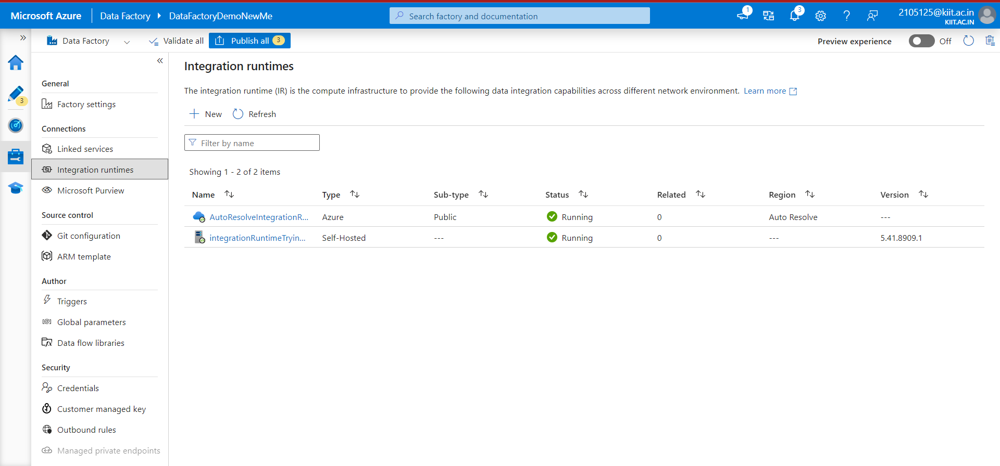
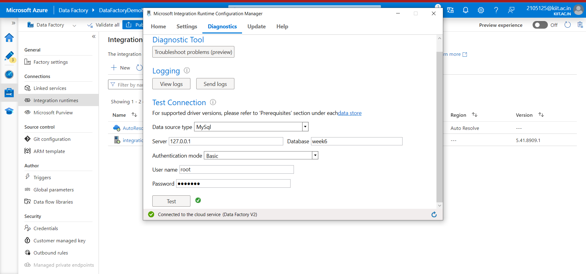
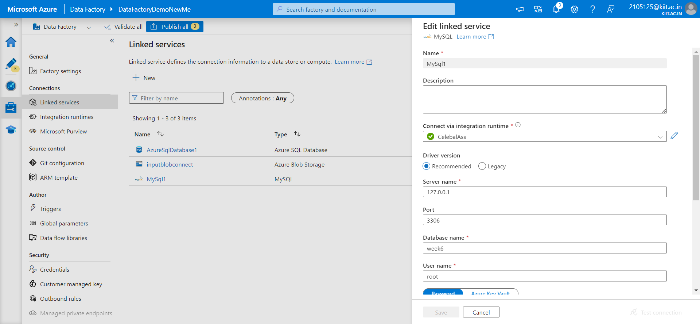
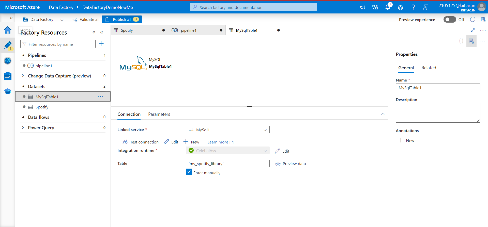
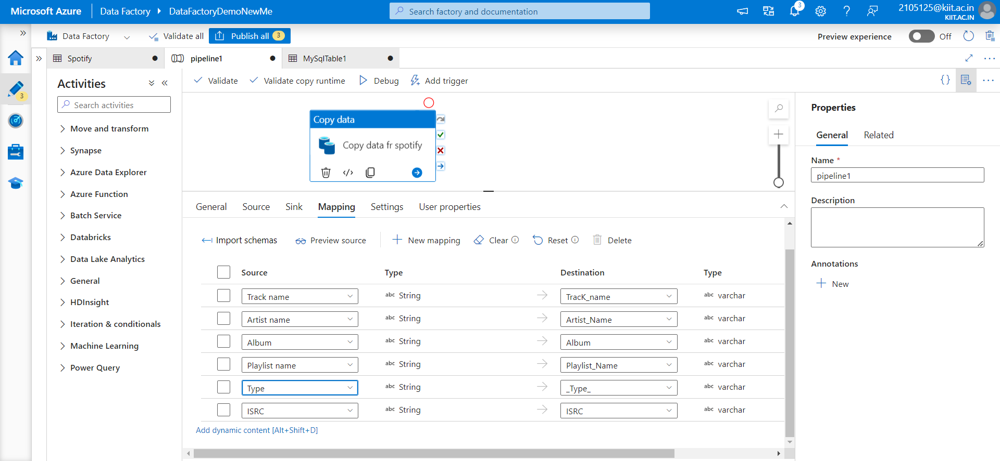
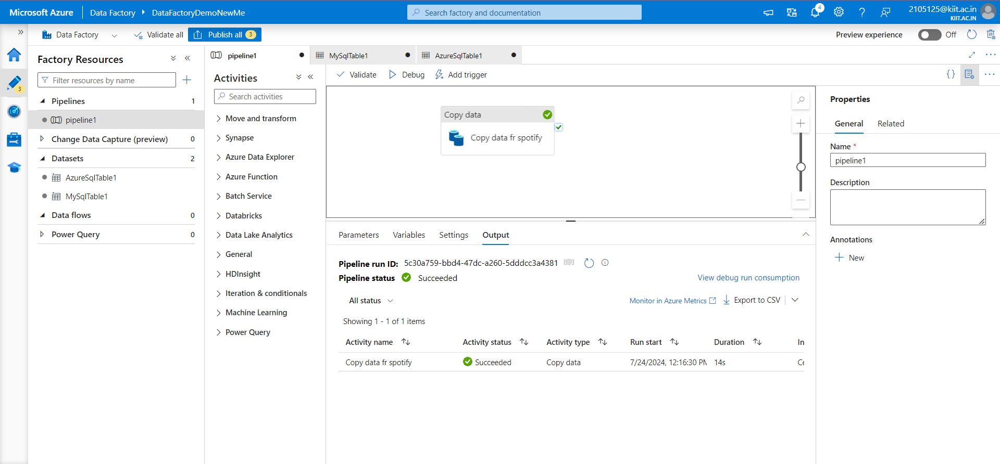
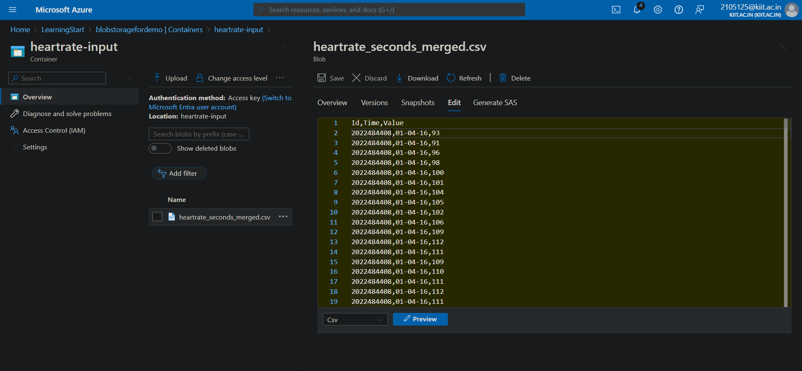
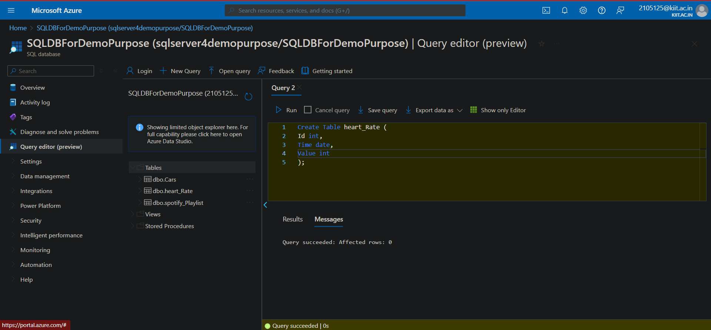
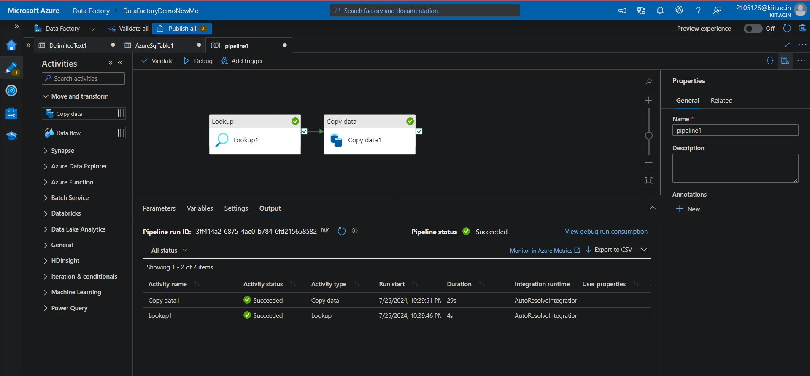
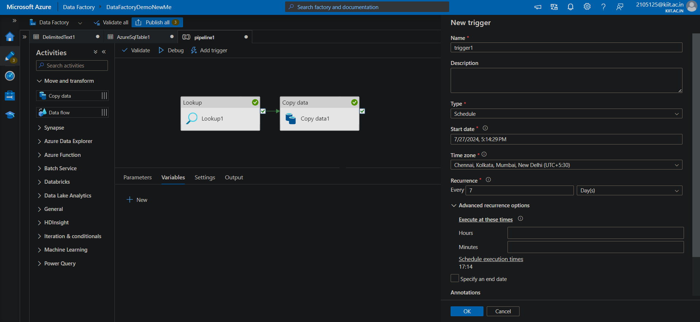

# Q1) Configure Self-hosted integration runtime to Extract the data from your local server and load it into azure DB
ANS:
Step 1:  Installed and configured a self-hosted integration runtime on your local server directly from azure Data Factory Integration Runtime.

Step 2) Connect your local DB

Step 3) Create Linked service from integrated runtime with azure data factory

Step 4) Create Databases for both local server and sql server in azure

Step 5 )Create a new pipeline in Azure Data Factory. 
Add a copy activity to the pipeline.
Configure the copy activity to use the MySQL dataset as the source and the Azure SQL Database dataset as the sink.
Map the columns between the source and destination as needed.

Step 6) Test the pipeline

Q3)Create Incremental load pipeline and automate this on daily basis
Step 1) Ingest Data with a Timestamp Column

Step 2)Create a new dataset for your source data and sink data

Step 3)  Create a Pipeline for Incremental Load with lookup activity and copy activity

Q4)Automate a pipline to trigger every last Saturday of the month

# Q3 and Q4

#### Q3 ) **Create a pipeline to copy customer data from db to adls only if record count is more than 500. Once a data get copy it should call a child pipeline (which will copy the product data from table if customer record count is > 600).**

**Create the Parent Pipeline (Customer Data Pipeline):**

* **Step 1: Create a new pipeline.**
* **Step 2: Add a Lookup activity** to check the record count of the customer data table. Configure it to execute a query that returns the record count.
* 
* **Step 3: Add an If Condition activity** to evaluate if the record count is greater than 500
* 
* **Step 4: Inside the If Condition activity (True branch), add a Copy Data activity** to copy customer data from the database to ADLS.
* 
* **Step 5: Add an Execute Pipeline activity** inside the True branch of the If Condition activity to call the child pipeline (Product Data Pipeline).
* 
* **Create the Child Pipeline (Product Data Pipeline):**
* ****Add a parameter to the child pipeline** to accept the customer count value.**
* 
* **Add an If Condition activity** to evaluate if the customer count is greater than 600.
* 
* **Inside the If Condition activity (True branch), add a Copy Data activity** to copy product data from the database to ADLS.
* 

### Validate the Pipeline 

